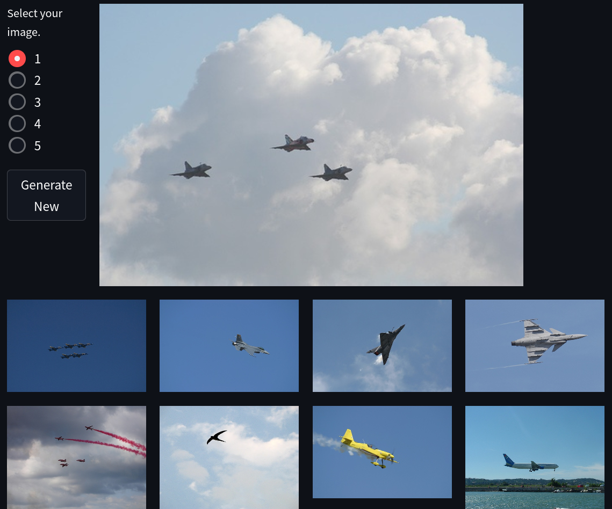
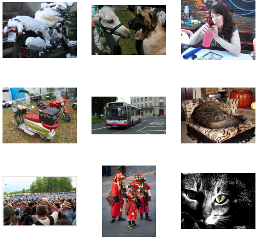
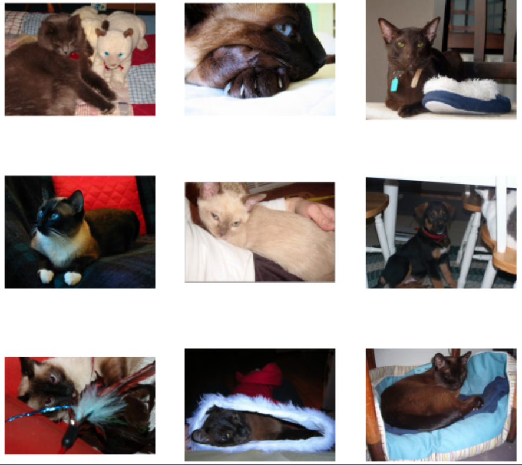

### A search engine to find images containing the same object

In this project I used a pretrained ResNet34 model to get a feature map of a set of images. Then for a selected image, I get its feature vector with the model, and select images from the dataset with the lowest Euclidean distance. In this blog I'll explain how you can build something similar and the steps I followed to build it myself.

## Step 1: The Dataset
In general, the larger the database, the better your search engine (duh).
I experimented with two datasets: ImageNet and the Pascal VOC datasets. Ultimately it doesn't matter which dataset you choose but I went with randomly picking ~1000 images from the Pascal VOC dataset because Heroku's free tier for app deployment restricts the size. 
In the project folder, place the dataset in a folder called data.
Here's a random sample of the data:


## Step 2: Generating and storing hidden features
I used feature vectors from an intermediate layer of PyTorch's pretrained ResNet34 model as a way to distinguish images.
> Q. What are feature vectors?
> 
> They are lists of numbers to represent the image. In this case, they are the activations of the model's "neurons" of a particular layer when the image is used as input.

> Q. Why not use the image itself as the feature vector?
> 
> There are a few reasons for this:
> - this would place too large an emphasis on the color values of the pixels of the image. This might be a good metric if we wanted to find images with similar colors but we want images with a similar object/situation
> - depending on the size of the image, the computation would be too heavy. 
	
Let's get the basic part of the script out of the way. This will load the modules, set up the dataloader, and prepare the model to be used for inference:
```python
# create_ftrs.py
# imports:
import torch
import torchvision
from torchvision import datasets, transforms
from torchvision.models import resnet34
from torch.utils.data import DataLoader, Dataset
import os
import numpy as np

# pytorch transforms to prepare for pretrained model
trfms = transforms.Compose([
    transforms.Resize(256),
    transforms.CenterCrop(224),
    transforms.ToTensor(),
	
	# this line is required for pretrained models in pytorch
	# find more details at https://pytorch.org/vision/stable/models.html
    transforms.Normalize(mean=[0.485, 0.456, 0.406], std=[0.229, 0.224, 0.225]),
])

# define pytorch dataset and dataloader
data_dir = 'data'
# ImageFolder expects data in folders inside the root folder
dataset = datasets.ImageFolder(data_dir, trfms) 
# using a larger batch_size will speed everything up 
dl = DataLoader(dataset, batch_size=32, shuffle=False) 


# get pretrained model
model = resnet34(pretrained=True)
# send to GPU if you have it
device = torch.device("cuda" if torch.cuda.is_available() else "cpu")
model.to(device)
# send eval mode on model since we're not training it
model.eval()
```

Now to extract the features, we need to register a "hook" to the model. This hook is just a function attached to a layer of the model that will run when its activations are calculated. I attached this hook to the model's avgpool layer. 
```python
# the feature vector gets saved to this dictionary
features = {}

def get_features(name):
	"""
		returns the hook function itself
		the reason behind taking a name parameter is so if you're
		attaching multiple hooks, its easier to access them via a simple
		key lookup
	"""
	def hook(model, input, output):
		features[name] = output.detach()
	return hook

# register the hook to the model
model.avgpool.register_forward_hook(get_features('data'))
```

The final step now that everything is set up is to run the model in inference mode and send the batches to it. 
```python
# The feature vectors of each batch get stored here
stored_ftrs = []

with torch.no_grad():
    # iterate through the dataloader
	for i, (img, label) in enumerate(dl):
        # print every 10 batches:
		if (i + 1) % 10 == 0:
            print(i+1)
        
		img = img.to(device)
        output = model(img)
        
		# append features['data'] to stored_ftrs
		# (remember the dictionary I created before)
		stored_ftrs.append(features['data'].cpu().numpy())

# finally, save the feature vectors array to file
np.save('stored_ftrs.npy', stored_ftrs, allow_pickle=True)
```

## Step 3: The actual search
The generated feature vector of each image in the dataset is just that - a vector. So we can apply the concept of euclidean distance or L2 norm to find images that are close to a specific image. 
> Q. What is Euclidean distance / L2 norm?
> 
>  [Jason Brownlee on machinelearningmastery.com can explain this better I can](https://machinelearningmastery.com/vector-norms-machine-learning/#:~:text=The%20L2%20norm%20calculates%20the,is%20a%20positive%20distance%20value.)

I defined some helper functions for this:
```python

def compare(img):
	""" 
		does the exact same for the chosen image as we did
		for each image in the dataset
	"""
	compare_ftrs = []
    with torch.no_grad():
        img = trfms(img)
		# unsqueeze is important because the model expects a batch of images
        img = img.unsqueeze(0)
        output = model(img)
        compare_ftrs.append(features['data'].cpu().numpy())
    return compare_ftrs

def get_distances(compare_img_tensor):
	# returns the distance of chosen image from each image in the dataset
    distances = []
    for batch in stored_ftrs:
        for img in batch:
			# L2 norm
            dist = np.linalg.norm(compare_img_tensor - img)
            distances.append(dist)
    return distances

def get_best_indices(distances, n=10):
    """
		Get the indices in the distances list of the n smallest 
		distances. 
	"""
	dist_sorted = sorted(distances)
    image_idxs = []
    for d in dist_sorted[:n]:
        ind = distances.index(d)
        if ind not in image_idxs:
            image_idxs.append(ind)
    return image_idxs

def get_best_matches(image_idxs):
	""" 
		Returns the actual images from the dataset according to
		indices.
	"""
    results = {}
    for i in image_idxs:
        results[i] = check_dataset.samples[i][0]
    return results

```

To put it all together, I will take an image, and run it through the helper functions. At the end I will get 10 similar images:
```python

image = Image.open('santa_cat.jpg')
ftrs = compare(image)
distances = get_distances(ftrs[0])
best_indxs = get_best_indices(distances)
matches = get_best_matches(best_indxs)

# display (works in jupyter notebooks):
for i in best_indxs:
	image = Image.open(matches[i])
	display(image)

```

Lets see if it works:
Input image:

Search results:

Looks like it works!

## (optional) Step 4: Webapp
I used a popular framework called Streamlit to create a webapp for this simple search engine. Its pretty easy to do and you can check out the code on my [Github](https://github.com/ishandotsh/resnet-search-engine) or check out the live demo [here](https://resnet-search-engine.herokuapp.com/)
I had to make some changes to make it suitable for deployment but they should not be too difficult to understand. 

## That's it!
That concludes the project! Thanks for reading it!
Let me know if I've made any mistakes/missed anything/how I can make this better via my social links.